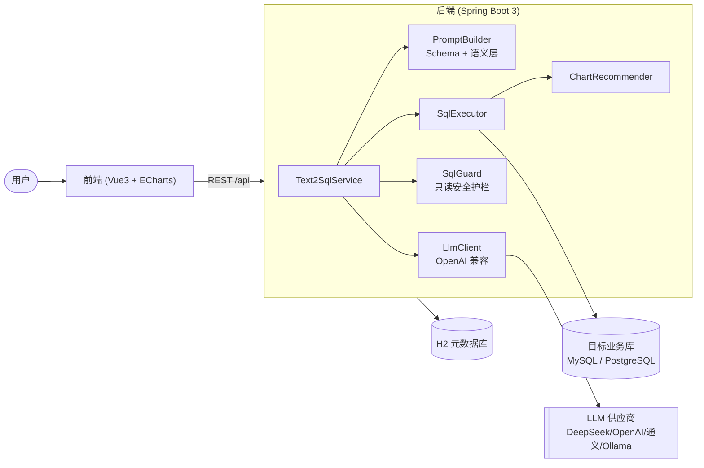

# 📊 ChatBI Copilot · 自然语言问数与可视化平台

> 用大白话问数据，自动生成**只读 SQL**、执行并给出**最合适的图表**。面向企业数据库/ERP 场景的
> Text2SQL 智能分析平台，前后端完整、可一键运行、可安全落地。

<p>
  
  
  
  
  
</p>

---

## 简介

ChatBI Copilot 让不懂 SQL 的业务同学也能「问数」：输入「各产品类目的销售额占比」，系统会读取库表结构与
字段注释、结合你配置的业务语义，让 LLM 生成 SQL，经过**只读安全护栏**校验后执行，并自动推荐柱状/折线/
饼图进行可视化，同时支持多轮追问、查询历史、收藏与导出 Excel。

LLM 走 **OpenAI 兼容接口**，可在 DeepSeek / OpenAI / 通义千问 / 本地 Ollama 之间通过配置自由切换，
API Key 通过环境变量注入，绝不入库、不进代码。

## ✨ 亮点

- **Schema 感知的 Text2SQL**：自动读取表/字段及**注释**，叠加语义层的业务别名与描述，大幅提升生成准确率。
- **只读安全护栏（核心）**：JSqlParser 解析 + 正则兜底，**仅允许单条 SELECT**，拦截 DML/DDL、多语句、
  `OUTFILE`/`sleep`/`load_file` 等危险构造，自动注入 `LIMIT`，连接池强制只读——多重纵深防御。
- **自动可视化**：根据结果集的维度/度量/时间列智能推荐图表类型，前端可一键切换柱/折线/饼/表格。
- **可插拔 LLM**：任意 OpenAI 兼容供应商，配置即用；内置「LLM 未配置」友好提示。
- **多数据源**：同时管理多个 MySQL / PostgreSQL，界面查看库表结构。
- **语义层**：为表/字段配置业务别名与口径（如 `status=paid` 表示已支付），让模型「听得懂业务黑话」。
- **完整工程化**：统一响应/异常、参数校验、Swagger API 文档、单元测试、Docker 一键部署、密码 AES 加密。
- **好用的体验**：对话式问数、多轮追问、澄清反问、查询历史、收藏、Excel 导出。

## 🖼️ 界面预览

> 首次启动后访问前端首页；填入 LLM Key 即可开始问数。

| 智能问数 | 数据源与库表结构 |
| --- | --- |
|  |  |

## 🏗️ 架构



更详细的组件图、请求时序图与安全护栏流程见 [docs/architecture.md](docs/architecture.md)。

## 🧰 技术栈

| 层 | 技术 |
| --- | --- |
| 后端 | Java 21、Spring Boot 3.3、MyBatis-Plus、JSqlParser、Apache POI、springdoc-openapi |
| 前端 | Vue 3、Vite 8、Element Plus、ECharts 6、Pinia、Vue Router、Axios |
| 存储 | H2（应用元数据，内嵌零配置）、MySQL/PostgreSQL（目标业务库） |
| LLM | 任意 OpenAI 兼容接口（DeepSeek / OpenAI / 通义 / Ollama） |
| 部署 | Docker、docker-compose、Nginx |

## 🚀 快速开始

### 方式一：Docker Compose 一键启动（推荐）

```bash
# 1. 准备环境变量（主要填 LLM_API_KEY）
cp .env.example .env
#   编辑 .env，把 LLM_API_KEY 换成你的真实 Key

# 2. 一键启动：MySQL 示例库 + 后端 + 前端
docker compose up -d --build

# 3. 打开浏览器
#    前端:      http://localhost:8888
#    健康检查:  http://localhost:8080/api/health
#    API 文档:  http://localhost:8080/api/swagger-ui.html
#    示例 MySQL（可选，用客户端连库）: localhost:13306（容器内仍为 3306）
```

如本机端口已被其他项目占用，可在 `.env` 中覆盖：

```bash
FRONTEND_HOST_PORT=18888
BACKEND_HOST_PORT=18084
MYSQL_HOST_PORT=13316
docker compose up -d --build
```

启动后 MySQL 会自动导入 `sample-data/mysql` 的建表与种子数据，后端会自动注册一个指向该示例库的
数据源，打开前端即可直接问数。试试：

- `各产品类目的销售额占比`
- `2024年每月销售额趋势`
- `销售额最高的5个产品`
- `各大区的客户数量`

### 方式二：本地开发

**后端**（需要 JDK 21、Maven）：

```bash
cd backend
# 国内网络建议带上阿里云镜像配置，避免走公司内网私服
mvn -s settings.xml spring-boot:run
# 通过环境变量注入 LLM Key（PowerShell 示例）：
#   $env:LLM_API_KEY="sk-xxx"; mvn -s settings.xml spring-boot:run
```

**前端**（需要 Node.js 20.19+ 或 22.12+）：

```bash
cd frontend
npm install --registry=https://registry.npmmirror.com
npm run dev
# 打开 http://localhost:5173 （已配置代理到后端 8080）
```

示例库可用 Docker 单独起：`docker compose up -d mysql`，或手动执行 `sample-data/` 下的 SQL。

## ⚙️ 配置说明

后端配置见 `backend/src/main/resources/application.yml`，均可用环境变量覆盖：

| 环境变量 | 说明 | 默认 |
| --- | --- | --- |
| `LLM_PROVIDER` | 供应商标识（仅展示用） | `deepseek` |
| `LLM_BASE_URL` | OpenAI 兼容 base url | `https://api.deepseek.com/v1` |
| `LLM_MODEL` | 模型名 | `deepseek-chat` |
| `LLM_API_KEY` | API Key（Ollama 可留空） | 空 |
| `LLM_TEMPERATURE` | 采样温度，SQL 生成建议 0 | `0.0` |
| `CHATBI_SECRET` | 数据源密码加密密钥，生产务必修改 | dev 值 |
| `DEMO_DATASOURCE_ENABLED` | 启动时自动注册示例数据源 | `false`（docker 下 `true`） |

SQL 护栏（`chatbi.sql-guard`）：`default-limit=500`、`max-limit=5000`，可在配置中调整。

## 🔐 SQL 安全护栏

“让 LLM 生成 SQL 直接连库”最大的风险是安全。本项目的护栏做了：

1. **仅只读**：只允许单条 `SELECT` / `WITH ... SELECT`；`INSERT/UPDATE/DELETE/DROP/...` 一律拒绝。
2. **拦截多语句与危险构造**：禁止 `;` 堆叠、`INTO OUTFILE/DUMPFILE`、`load_file/sleep/benchmark` 等。
3. **强制分页**：无 `LIMIT` 自动补，超限自动收敛到上限。
4. **纵深防御**：目标库连接池 `read-only`、`maxRows` 与 `queryTimeout` 双限。
5. **解析优先**：JSqlParser 解析成功则信任 AST（避免把恰好像关键字的列名误杀），解析失败才用关键字兜底。

对应实现见 `text2sql/service/SqlGuard.java`，并有专门单元测试覆盖。

## 📦 项目结构

```
chatbi-copilot/
├── backend/                 # Spring Boot 3 后端
│   ├── src/main/java/com/chatbi/copilot/
│   │   ├── datasource/      # 数据源管理 + Schema 读取
│   │   ├── semantic/        # 语义层
│   │   ├── llm/             # OpenAI 兼容 LLM 客户端
│   │   ├── text2sql/        # 提示词/护栏/执行/编排
│   │   ├── chart/           # 图表推荐
│   │   ├── history/         # 历史 + 收藏
│   │   ├── export/          # Excel 导出
│   │   └── config/ common/  # 配置、统一响应、异常、加密
│   ├── settings.xml         # 阿里云镜像（国内加速）
│   └── Dockerfile
├── frontend/                # Vue3 + Vite 前端
│   ├── src/{views,components,api,stores,router}
│   ├── nginx.conf
│   └── Dockerfile
├── sample-data/             # MySQL / PostgreSQL 建表 + 种子数据
├── docs/                    # 架构文档
├── docker-compose.yml       # 一键启动
└── .env.example
```

## 🔌 API 一览

完整文档见 Swagger UI：`http://localhost:8080/api/swagger-ui.html`

| 方法 | 路径 | 说明 |
| --- | --- | --- |
| POST | `/api/query/ask` | 自然语言问数（Text2SQL + 执行 + 图表） |
| POST | `/api/query/run` | 执行/重跑已知 SQL（经护栏） |
| GET | `/api/datasources` | 数据源列表 |
| POST | `/api/datasources/test` | 测试连接 |
| GET | `/api/datasources/{id}/schema` | 库表结构（含语义增强） |
| GET/POST/PUT/DELETE | `/api/semantic` | 语义层维护 |
| GET | `/api/history` | 查询历史（分页） |
| GET/POST/DELETE | `/api/favorites` | 收藏 |
| POST | `/api/export/excel` | 结果导出 Excel |
| GET | `/api/llm/status` | LLM 配置状态 |
| GET | `/api/health` | 健康检查（Docker smoke） |

## 🧪 测试

```bash
cd backend
mvn -s settings.xml test
```

覆盖 SQL 安全护栏（放行/拦截/LIMIT 注入/CTE/多语句/危险函数）与提示词组装（Schema 渲染/多轮）。

## 🗺️ Roadmap

- [ ] 基于表结构 + 术语的向量 RAG，进一步提升复杂问题准确率
- [ ] SQL 执行计划与耗时可视化
- [ ] 生成结果的自然语言总结（图表解读）
- [ ] 更多数据库方言（ClickHouse / Doris / SQLite）
- [ ] 用户与权限、行列级数据权限
- [ ] 流式输出（SSE）与生成过程展示

## 📄 License

[MIT](LICENSE) © ChatBI Copilot
