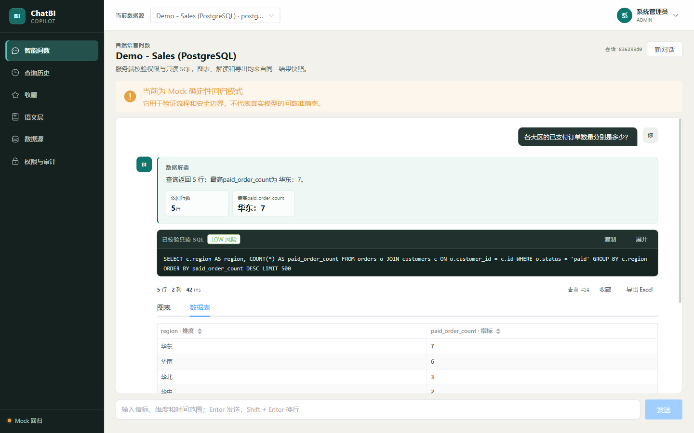
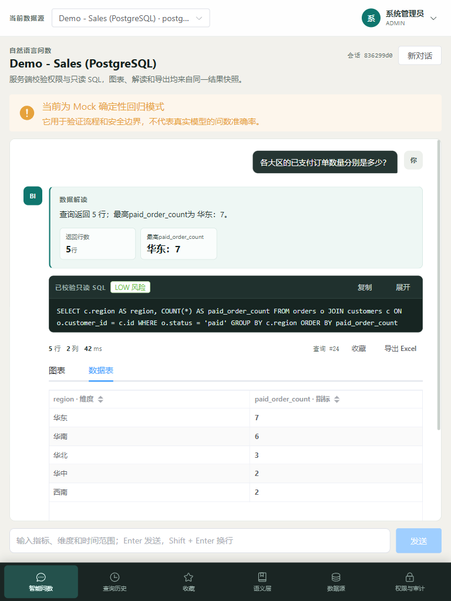
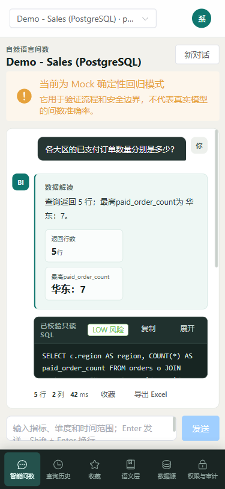
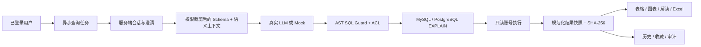

# ChatBI Copilot

ChatBI Copilot 是一个面向 MySQL / PostgreSQL 的自然语言问数工作台。它把登录与数据权限、语义层、Text2SQL、只读 SQL 护栏、执行计划、结果快照、图表、解读、历史、收藏和 Excel 导出放在同一条可审计链路中。

## 已实现能力

- 服务端随机会话，HttpOnly / SameSite Cookie、CSRF、登录限速和注销撤销。
- ADMIN / ANALYST / VIEWER 角色，以及数据源、表、敏感列和导出/语义管理权限。
- MySQL 8 与 PostgreSQL 16 独立只读账号核验；未通过核验的数据源不能查询。
- JSqlParser 单次 AST 校验；仅接受单条 `SELECT`，解析失败默认拒绝。
- LIMIT / OFFSET、危险函数、文件访问、锁、超时、最大行数和 EXPLAIN 扫描风险控制。
- 表、字段、指标、枚举、时间和 JOIN 六类语义定义；带版本快照、轻量检索和 Prompt 预览。
- 服务端多轮会话、必要澄清、异步阶段、取消、总超时、风险确认和重试。
- 表格、ECharts、确定性数据解读和 Excel 共用同一份 SHA-256 校验结果快照。
- 按用户隔离的历史和收藏；导出时重新检查当前权限，不沿用旧授权。
- Mock 零密钥回归和真实模型固定评估完全分开。

> 当前版本不实现行级权限重写，也不对此作承诺。数据源、表和敏感列权限均由服务端强制执行。

## 真实界面

| 桌面端 | 平板端 | 移动端 |
| --- | --- | --- |
|  |  |  |

截图来自真实浏览器，视口分别为 `1440×900`、`768×1024`、`375×812`。

## 运行要求

| 场景 | 要求 |
| --- | --- |
| Docker 零密钥演示 | Windows 10/11 + Docker Desktop，或 Linux + Docker Engine；均需 Compose v2 |
| 本地源码运行 | JDK 17+、Maven 3.9+、Node.js 22+、npm 10+；MySQL 8 / PostgreSQL 16 可由 Docker 提供 |
| 最低本地资源 | 2 vCPU、4 GiB 可用内存、5 GiB 可用磁盘；首次构建还需要访问镜像与依赖仓库 |

默认占用 `19030-19033`；验收和自定义覆盖也必须保持在 `19030-19039`。

## 快速开始：Docker 零密钥演示

要求：满足上表 Docker 环境，宿主机 `19030-19033` 可用。

```bash
cp .env.example .env
docker compose up -d --build
node scripts/smoke-mock-demo.mjs http://127.0.0.1:19030
```

Windows `cmd.exe` 可用：

```bat
copy .env.example .env
docker compose up -d --build
node scripts\smoke-mock-demo.mjs http://127.0.0.1:19030
```

打开 [http://127.0.0.1:19031](http://127.0.0.1:19031)。Compose 会自动创建两个结构和数据相同的演示库，并注册为已核验只读数据源。

| 服务 | 宿主机端口 |
| --- | ---: |
| Spring Boot API | `19030` |
| Vue 前端 | `19031` |
| MySQL 演示库 | `19032` |
| PostgreSQL 演示库 | `19033` |

本项目的本地运行和验收只使用 `19030-19039`。

### 演示账号

| 用户 | 密码 | 默认能力 |
| --- | --- | --- |
| `admin` | `ChatBI!Admin123` | 用户、权限、审计、数据源及全部业务能力 |
| `analyst` | `ChatBI!Analyst123` | 查询、导出、语义管理，可访问演示敏感列 |
| `viewer` | `ChatBI!Viewer123` | 查询，不可导出/管理语义，不可访问 `customers.name` |

这些固定口令只用于本地演示。生产模式会拒绝演示认证、默认加密密钥或非 Secure Cookie 配置。

### Mock 的边界

`.env.example` 默认 `LLM_PROVIDER=mock`。Mock 用于验证登录、权限、SQL 护栏、执行、图表和导出链路，不代表真实模型准确率。页面会明确显示 Mock 提示。

## 接入真实模型

支持 OpenAI-compatible Chat Completions 与 Responses API。编辑 `.env` 后重启 backend：

```dotenv
LLM_PROVIDER=openai
LLM_BASE_URL=https://api.openai.com/v1
LLM_MODEL=<model-name>
LLM_API_KEY=<your-key>
LLM_API_STYLE=responses
LLM_REASONING_EFFORT=none
LLM_TIMEOUT_SECONDS=60
```

DeepSeek、通义兼容模式、Ollama 等可使用 `chat-completions`。真实 Key 只放在未跟踪的 `.env` 或运行环境中。

## 本地源码运行

下列命令适用于 Linux shell；Windows `cmd.exe` 使用相同命令，目录分隔符可写为 `\`。先确认：

```bash
java -version
mvn -version
node --version
npm --version
docker compose version
```

先启动两个目标数据库：

```bash
docker compose up -d --wait mysql postgres
```

后端（默认 `19030`）：

```bash
cd backend
mvn -s settings.xml spring-boot:run
```

若需要自动注册本机演示库，设置 `DEMO_DATASOURCE_ENABLED=true`、`DEMO_DB_PORT=19032`、`DEMO_PG_ENABLED=true`、`DEMO_PG_PORT=19033`。前端（固定 `19031`）：

```bash
cd frontend
npm ci
npm run dev
```

## 核心链路



安全与架构细节见 [SECURITY.md](SECURITY.md) 和 [docs/architecture.md](docs/architecture.md)。

## 验证

后端单元与集成测试：

```bash
cd backend
mvn -s settings.xml test
```

真实双库安全测试（MySQL `19032`、PostgreSQL `19033` 已就绪）：

```bash
cd backend
mvn -s settings.xml -Dtest=RealDatabaseSafetyIT test
```

前端质量门槛：

```bash
cd frontend
npm run lint
npm run typecheck
npm test
npm run build
```

固定问数集真实模型评估：

```bash
node scripts/evaluate-nl2sql.mjs \
  --base-url http://127.0.0.1:19030/api \
  --dataset eval/nl2sql-eval-v1.json \
  --output reports/nl2sql-eval-real.json
```

Runner 会拒绝未配置或 Mock provider，并以参考 SQL 与生成 SQL 的实际执行结果等价评分。`glm-5.2` 较早一次全量报告为 `46/46`；最新全量回归为 `43/46`（93.48%）、澄清/拒绝 `11/11`，三个门槛仍全部通过。随后平均客单价与大区订单意图的定向报告均为 `2/2`；定向结果不替代最新全量准确率。详见 `reports/README.md`。

本地性能门槛：

```bash
python loadtest/dry_run.py \
  --base-url http://127.0.0.1:19030/api \
  --iterations 15 --concurrency 3 \
  --output reports/performance-local.json
```

## 项目结构

```text
backend/            Spring Boot、Flyway、权限、查询与测试
frontend/           Vue 3、Element Plus、ECharts
sample-data/        MySQL / PostgreSQL 等价演示库和只读账号
eval/               固定问数集
scripts/            Smoke、真实模型评估、密钥扫描
loadtest/           认证态本地性能门槛
performance/        k6 并发脚本
reports/            可复核的评估与性能报告
docs/               架构、使用、性能与真实截图
```

## 文档

- [使用指南](docs/USAGE.md)
- [部署说明](DEPLOYMENT.md)
- [安全说明](SECURITY.md)
- [架构设计](docs/architecture.md)
- [性能方法与报告](docs/PERFORMANCE.md)
- [变更记录](CHANGELOG.md)

## 生产边界

- H2 文件元数据库适合单实例；多实例生产部署应迁移到外部元数据库。
- 外部 LLM 延迟与配额单独统计，不纳入本地 API p95。
- 生产应关闭演示账号和数据源，设置随机 `CHATBI_SECRET`，启用 HTTPS 与 Secure Cookie。
- 业务数据库账号必须保持独立只读；应用启动和数据源保存均不替代数据库侧最小授权。

## License

[MIT](LICENSE)
