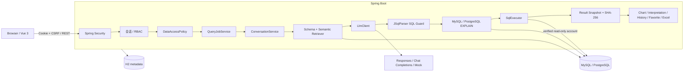
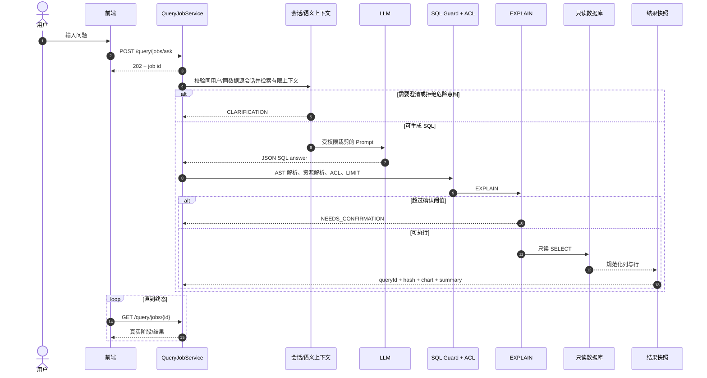
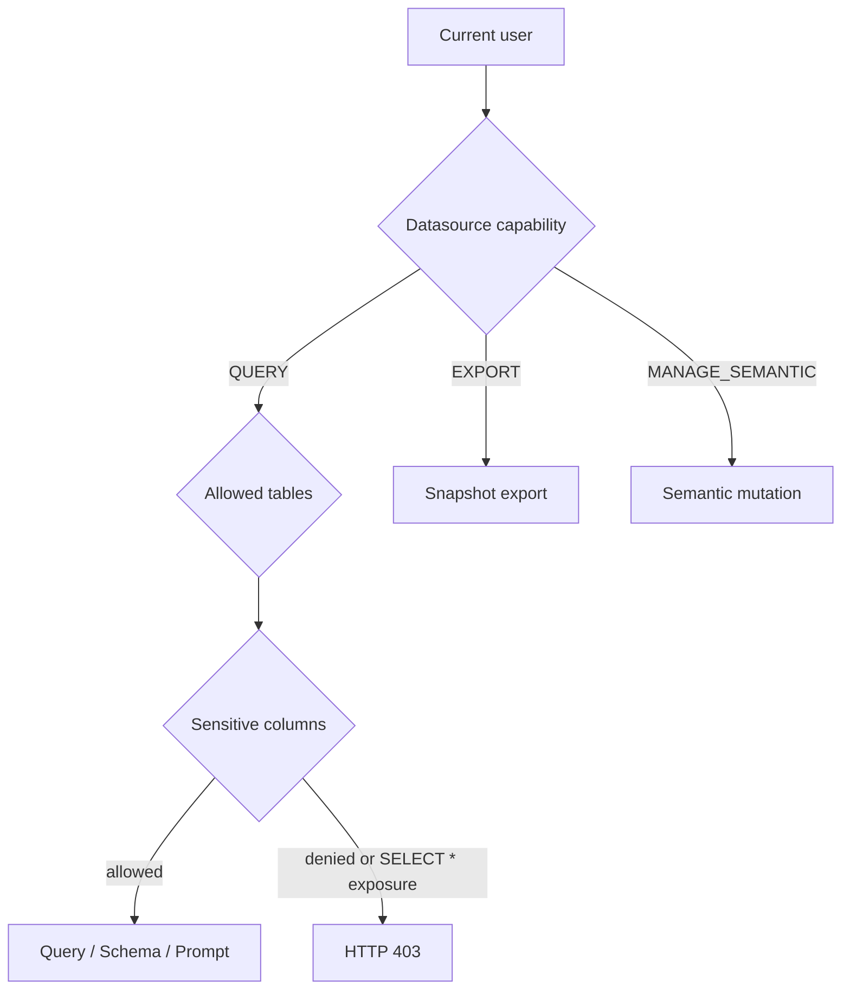
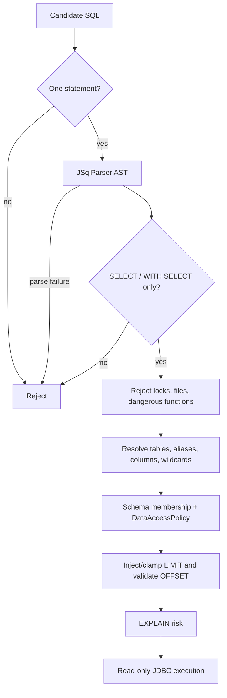

# ChatBI Copilot 架构

## 总体结构

前端只负责呈现和发起动作；身份、权限、SQL 判定、风险决策和结果完整性均由后端决定。

## 查询时序

取消使用 `DELETE /query/jobs/{id}`，会同时取消任务 Future 和正在执行的 JDBC Statement。重试创建新任务并保留原任务审计记录。

## 身份与权限

### 会话

- 登录令牌为随机值，数据库只保存 SHA-256 哈希。
- `SessionAuthenticationFilter` 恢复用户；过期、注销或禁用用户都会使旧 Cookie 失效。
- `CsrfProtectionFilter` 保护 POST / PUT / DELETE。

### 授权层次

管理员绕过 ACL 数据行，但仍受 SQL 护栏和数据库只读账号限制。非管理员必须同时通过数据源能力、表 ACL 与敏感列 ACL。

## SQL 安全

不存在解析失败后的字符串放行路径。数据库层是独立防线：MySQL grant 和 PostgreSQL 角色/对象权限在数据源核验时检查，连接池和事务再设置只读。

## 语义层

一张 `semantic_model` 表保存 TABLE、COLUMN、METRIC、ENUM、TIME、JOIN 六类定义；`semantic_revision` 保存每次 CREATE / UPDATE / DELETE 的版本快照。

查询时不会把完整数据库无条件塞进 Prompt。`SemanticContextRetriever` 根据问题和服务端多轮历史选取相关表、字段和定义，并受字符预算与当前 ACL 限制。Prompt 预览复用同一检索逻辑。

## 结果一致性

成功查询写入：

- 规范化列元数据；
- 保留精度的结果行；
- 行数、截断状态、耗时和风险；
- 图表配置与确定性摘要；
- 规范化快照的 SHA-256。

历史详情、收藏原始结果和 Excel 都按 `queryId` 读取该快照并核验哈希，因此不会重跑 SQL 或产生不同时间点的数据。图表仅引用快照字段；空值、非法数字和高精度字符串不会被静默转为 0。

## 持久化

Flyway 管理 H2 元数据库，主要表包括：

- `app_user`、`user_role`、`auth_session`；
- `ds_config`、`datasource_acl`、`table_acl`、`column_policy`、`column_acl`；
- `semantic_model`、`semantic_revision`；
- `query_session`、`query_job`、`query_history`、`favorite`；
- `audit_event`。

H2 文件模式面向单实例部署。多实例时应迁移到共享元数据库，并保持当前唯一约束和事务语义。

## 后端模块

| 包 | 职责 |
| --- | --- |
| `auth` | 用户、角色、会话、CSRF、登录限速、生产启动闸门 |
| `permission` | 数据源/表/敏感列 ACL 与管理员权限矩阵 |
| `datasource` | CRUD、凭据加密、Schema、连接池、双库只读核验 |
| `semantic` | 六类语义定义、版本、检索与 Prompt 预览 |
| `text2sql.job` | 异步阶段、并发、取消、超时、重试 |
| `text2sql.service` | 澄清、Prompt、AST 护栏、执行、解读 |
| `text2sql.plan` | MySQL / PostgreSQL EXPLAIN 与风险模型 |
| `history` / `export` | 会话、快照、历史、收藏、Excel |
| `audit` | 安全和业务动作的可检索审计事件 |

## 明确边界

- v1 没有行级权限规则或 SQL 行过滤重写。
- Mock 是确定性流程回归，不是模型效果评估。
- 外部 LLM 调用受供应商延迟、可用性和配额影响。
- H2 元数据库不支持多实例并发所有权。
