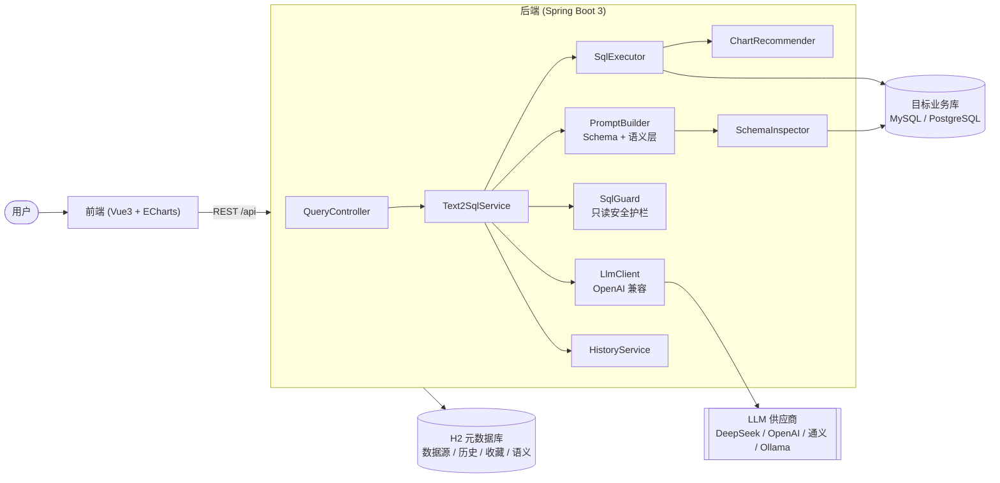
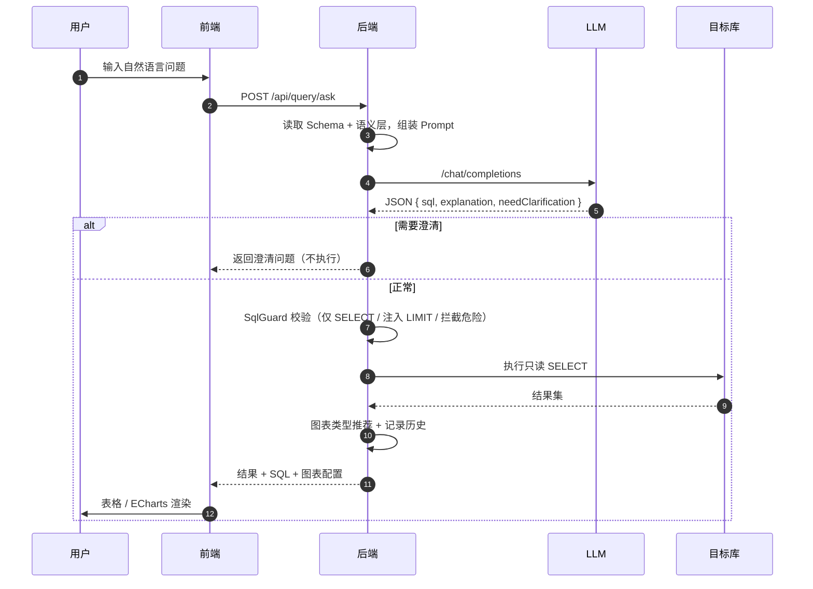
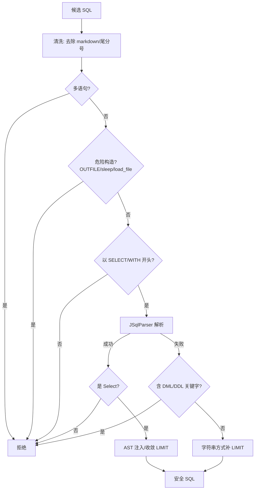

# 架构设计

## 1. 总体架构

ChatBI Copilot 采用「前后端分离 + 可插拔 LLM」的架构：前端负责交互与可视化，后端负责
Schema 感知的提示词组装、LLM 调用、SQL 安全护栏、查询执行与图表推荐。应用自身的元数据
（数据源、历史、收藏、语义层）存储在内嵌 H2 中，做到零外部依赖即可启动。

## 2. 问数请求时序

## 3. SQL 安全护栏

只读护栏是本项目的安全核心，采用「解析优先信任 + 正则兜底」的双层策略：

额外的纵深防御：
- 目标库连接池强制 `read-only`；
- `Statement.setMaxRows` 与 `queryTimeout` 双重限制；
- LIMIT 默认 500、上限 5000（可配置）。

## 4. 模块划分（后端）

| 包 | 职责 |
| --- | --- |
| `datasource` | 数据源 CRUD、连接池管理、Schema/注释读取 |
| `semantic` | 表/字段业务别名与描述，增强 Schema |
| `llm` | OpenAI 兼容客户端，供应商可配置切换 |
| `text2sql` | 提示词组装、SQL 护栏、执行器、编排 |
| `chart` | 结果集图表类型推荐 |
| `history` | 查询历史、收藏 |
| `export` | 结果导出 Excel |
| `config` / `common` | 配置属性、统一响应、异常、加密 |

## 5. 数据存储

- **应用元数据**：内嵌 H2（文件模式，`./data/chatbi`），随应用启动自动建表，零配置。
- **目标业务数据**：用户在「数据源」中配置的 MySQL / PostgreSQL，仅只读访问。
- **密码安全**：数据源密码使用 AES-GCM 加密后存储，密钥由 `CHATBI_SECRET` 派生。
